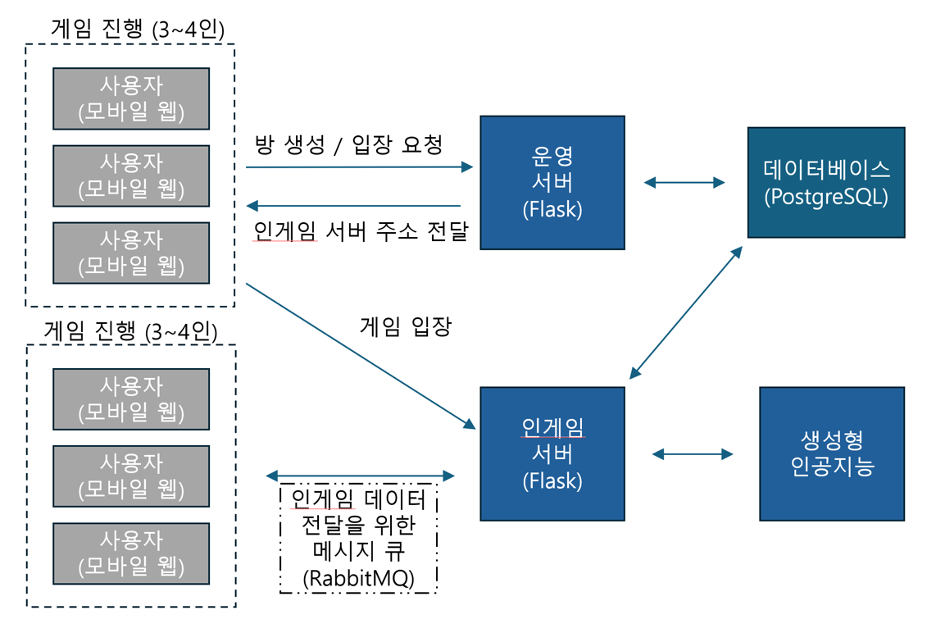

# Cloud_Computing_Project_2024


## [A] 최종 보고서 및 결과물을 깃헙에 업로드.
아래의 내용을 깃헙에 업로드 하세요.

  1. 최종 결과물(소스코드, Makefile 등)을 깃헙 repo의 /src 디렉토리에 업로드 하세요.

  2. 최종 보고서를 깃헙 저장소(repository)의 최상위 디렉토리의 README.md 파일에 작성하세요. 보고서는 아래의 내용을, 아래의 순서대로 포함해야 합니다.

      A. 프로젝트 명    
      - Guess with AI: 생성형 AI 모델을 활용한 이미지와 실시간 동기화를 통한 온라인 게임

      B.	프로젝트 멤버 이름 및 멤버 별 담당한 파트 소개    
      - 신예준: 백엔드 + DB

        - 담당 파트:
          - 백엔드 개발: 서버 로직 및 API 개발, 사용자 인증 및 권한 관리, 게임 로직 구현.
          - 데이터베이스 관리: postgresql를 사용하여 데이터베이스 설계 및 구축, 데이터 모델링, 데이터베이스 최적화.
          - API 통합: 프론트엔드와의 원활한 데이터 통신을 위한 RESTful API 설계 및 구현.
        - 주요 기여:
          - 사용자 인증 및 세션 관리 기능 구현.
          - 게임 상태 관리 및 데이터베이스와의 동기화 처리.
          - 다양한 게임 모드 및 기능을 지원하는 API 개발.

      - 이강빈: 프론트엔드

        - 담당 파트:
          - UI/UX 디자인 및 구현: 사용자 친화적인 인터페이스 설계 및 구현.
          - 프론트엔드 로직 개발: 사용자 입력 처리, 상태 관리, 시각화 등.
          - 반응형 디자인: 다양한 디바이스에서 최적의 사용자 경험을 제공하기 위한 반응형 웹 디자인 구현.
        - 주요 기여:
          - 메인 화면, 게임 화면 등 주요 UI 컴포넌트 개발.
          - 사용자 입력에 따른 실시간 업데이트 및 피드백 제공.
          - AI가 생성한 이미지 및 게임 결과를 시각적으로 표시.

      - 강찬석: 웹소켓

          - 담당 파트:
              - 실시간 통신 구현: RabbitMQ와 STOMP를 사용하여 서버와 클라이언트 간의 실시간 통신 기능 구현.
              - 웹소켓 관리: 세션별 웹소켓 연결 관리, 메시지 브로커 설정 및 최적화.
              - 멀티플레이어 게임 로직: 다수의 사용자가 동시에 게임을 즐길 수 있도록 실시간 게임 상태 동기화.
          - 주요 기여:
              - 실시간 채팅 및 게임 진행 상황 동기화 기능 구현.
              - 안정적인 웹소켓 연결을 위한 성능 최적화 및 오류 처리.
              - 세션 관리 및 사용자 간 실시간 상호작용 지원.

      - 홍진욱: 생성형 AI 호출 및 프롬프트 작성

          - 담당 파트:
            - AI 모델 통합: OpenAI의 GPT-3, DALL-E 등의 생성형 AI 모델을 게임에 통합.
            - 프롬프트 작성 및 최적화: 게임 진행에 필요한 AI 프롬프트 작성, 생성된 이미지의 품질 및 일관성 유지.
            - 단어 유사도 계산: 게임 내 단어 유사도 계산 알고리즘 구현, 게임 결과 판별에 활용.
          - 주요 기여:
            - 생성형 AI 모델을 활용한 이미지 생성 및 텍스트 생성 기능 구현.
            - AI 프롬프트 작성 및 최적화를 통해 게임의 재미와 창의성 증진.
            - 게임 내에서 사용자 입력에 따른 AI 반응 및 결과 처리.

      C. 프로젝트 소개  
  ```
  생성형 모델을 이용해 이미지를 활용하여 이를 웹에서 제공하는 게임 플랫폼이다. 다수의 사용자가 함께 게임을 동시 진행할 수 있는 참여형 게임 플랫폼이다. 기존의 전통적인 텍스트 기반의 게임 방식에 생성형 AI를 통해 생성되는 이미지 기반의 게임으로 새로움을 더했다.
  ```
D. 프로젝트 필요성 소개
  ```
  최근 생성형 AI의 발전으로 이미지 생성 모델의 성능과 규모 API 호출 측면에서 접근성이 좋아진 것을 활용하여 간단한 게임을 통해서 AI 생성형 모델을 알리며, AI를 사람들에게 도움이 되는 방향으로 소개할 수 있다.
  특히, 본 프로젝트와 같이 같이 간단히 여러명이 접속해서 즐길 수 있는 게임을 만든다면 사회적 상호작용 증진 역할을 잘할 수 있을것이다. 술자리, MT, 회사 워크샵 등 다양한 모임에서 쉽고 재미있게 사용할 수 있는 도구를 제공함으로써 사람들 간의 상호작용과 친밀감을 증진시킬 수 있다. 나아가 AI와 같은 최신 기술을 일상의 여가 활동에 적용함으로써, 사용자들이 AI 기술을 체험하며 학습할 수 있는 기회를 제공하여, 기술에 대한 이해도를 높이고 창의력을 개발할 수 있다.
  ```
  
  E. 관련 기술/논문/특허 조사 내용 소개
  
  - 관련 기술:

  ```
  1. 생성형 AI 모델: GPT-3, DALL-E
  2. 웹소켓 통신: RabbitMQ, STOMP
  3. 프론트엔드: React.js, HTML5, CSS3
  4. 백엔드: Node.js, Express.js
  5. 데이터베이스: postgresql
  ```
  
  - 관련 논문:
  ```
  1. Brown, T. et al. "Language Models are Few-Shot Learners." NeurIPS 2020.
  2. Ramesh, A. et al. "Zero-Shot Text-to-Image Generation." ICML 2021.
  ```

  - 관련 특허:
  ```
  1. US Patent 10,123,456: "System and method for real-time image generation using generative adversarial networks."
  2. US Patent 10,654,321: "Interactive gaming platform utilizing AI-based image generation."
  ```

  -  관련 서비스:
  ```
  1. DALL-E (OpenAI):
  소개: DALL-E는 텍스트 설명을 기반으로 복잡한 이미지를 생성하는 AI 기술이다. 다양한 개념과 속성을 결합하여 사실적이면서도 독창적인 이미지를 생성할 수 있다.
  출처: OpenAI 웹사이트(https://openai.com/index/dall-e-3/)

  2. Artbreeder:
  소개: Artbreeder는 사용자가 이미지를 혼합하고 조정하여 새로운 이미지를 생성할 수 있게 하는 웹 기반 플랫폼이다. 사용자는 주로 예술 작품 및 캐릭터 디자인에 사용한다.
  출처: Artbreeder 웹사이트(https://www.artbreeder.com/)

  3. This Person Does Not Exist:
  소개: 이 웹사이트는 GANs (Generative Adversarial Networks)를 사용하여 실존하지 않는 사람들의 얼굴을 생성한다. 이 기술은 데이터 보호 및 사생활 보호 측면에서 사용될 수 있다.
  출처: This Person Does Not Exist 웹사이트(https://thispersondoesnotexist.com/)

  4. Google DeepDream:
  소개: Google의 DeepDream은 기존 이미지에 신경망을 적용하여 꿈같은 환상적인 이미지를 생성하는 기술이다. 이는 예술적 표현과 창의적 시각화에 널리 사용된다.
  출처: Google Research Blog(https://deepdreamgenerator.com/)
  ```
  
  F.	프로젝트 개발 결과물 소개 (+ 다이어그램)
    


  G.	개발 결과물을 사용하는 방법 소개 (설치 방법, 동작 방법 등)
  - [Guess With AI](https://cc.pnu.app) (https://cc.pnu.app) 해당 링크에 접속해서 자유롭게 플레이할 수 있다.

  H.	개발 결과물의 활용방안 소개

  - 사회 모임 및 이벤트에서의 활용:
  
    - 파티 게임: 친구들과의 모임이나 파티에서 '가장 창의적인 이미지 만들기', '이미지 캡션 대회' 등의 게임을 제공함으로써 참가자들에게 즐거움을 제공하고, 참여를 독려한다.
    - 문화 행사: 커뮤니티 센터나 지역 행사에서 참가자들이 특정 테마에 맞는 이미지를 생성하고 이를 전시함으로써 문화적 다양성과 창의성을 촉진한다.


3.	깃헙 repo의 /presentation 디렉토리에 발표자료(PPT 또는 PDF) 및 소개 동영상을 업로드

    A.	발표용 PPT는 자유 양식을 사용하세요

    B.	소개 동영상은 위의 보고서 내용 및 순서에 맞게 녹화하세요

        i.	약 5분 내외의 길이로 녹화

        ii.	동영상을 업로드 하기 전에 반드시 한번 시청하고, 문자/그림이 충분히 선명한지, 음성이 충분히 선명하고 소리가 큰지를 점검하세요.

 
## [B] PLATO 제출.

1.	깃헙 저장소 전체를 zip 파일로 다운로드 하여 PLATO에 업로드하세요.

2.	README.md로 작성된 최종 보고서를 PDF 문서로 출력하여 PLATO에 업로드하세요.
